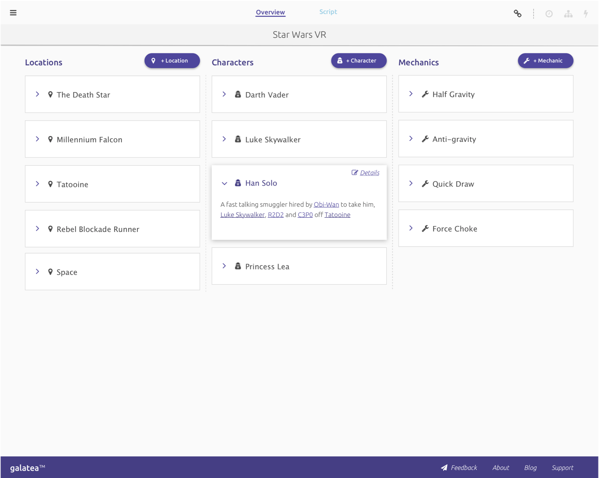
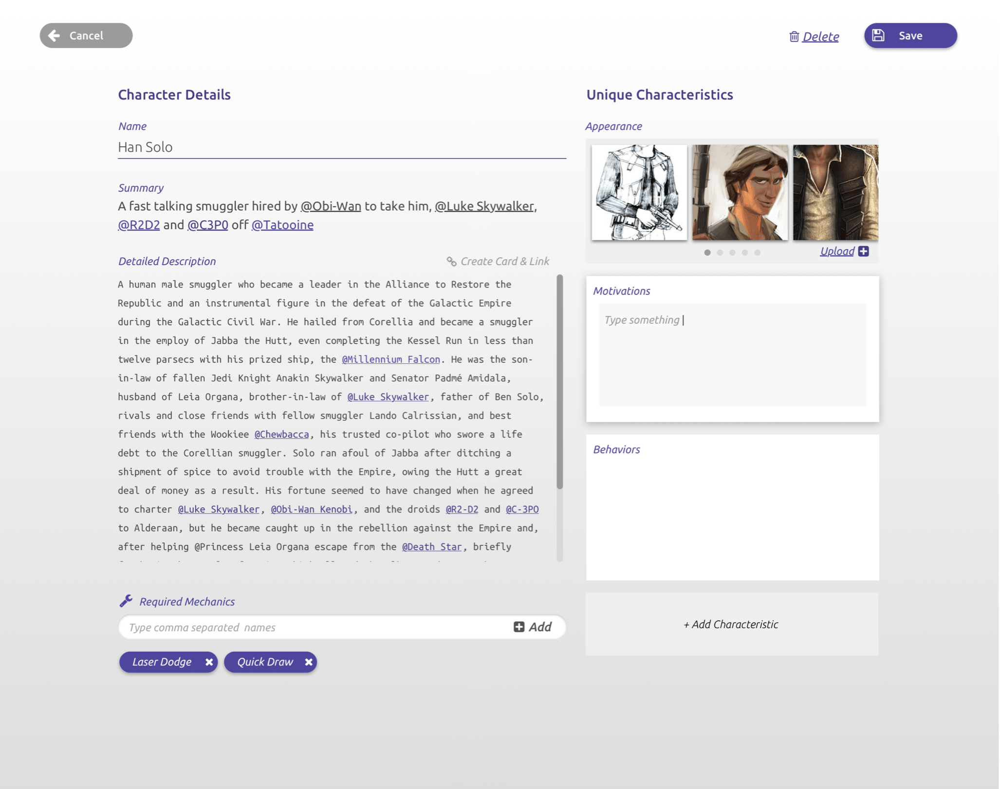
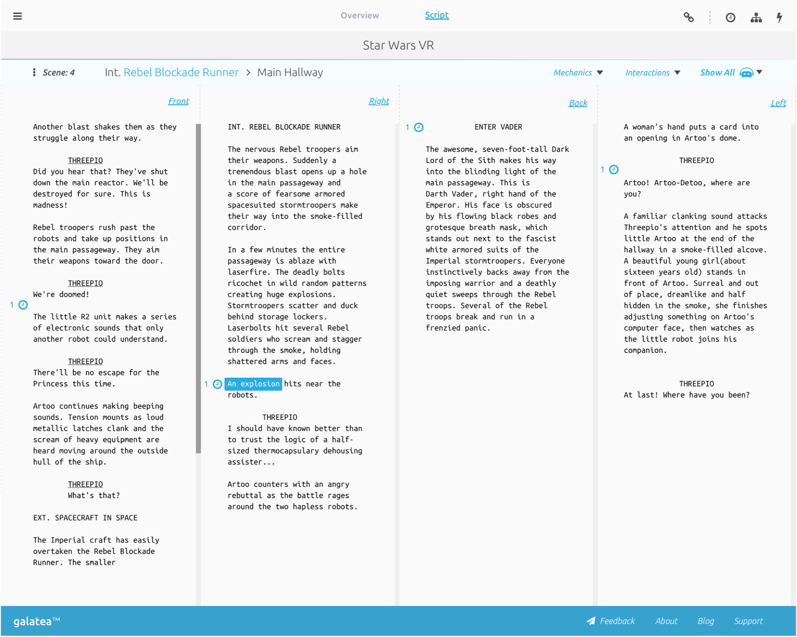

### Overview

Galatea Design is a writing a project management tool for immersive stories that I started with my longtime friend Jesse.
Jesse is writer and poet who was struggling to find a way to manage the complexities of writing for virtual reality with the available writing software. 
After a several months discussing Virtual Reality and Immersive Storytelling, I decided to quit my job at Snap Mobile and move from Chicago to Los Angeles to work on the project with Jesse full-time. 

The application has two main components - the overview and the script. In the overview users document the characters, locations, and mechanics of the story. This helps the team organize all of the elements of the story and provides a central location for changes. In the script component the users write th story, with the ability to hyperlink to any elements references. The key feature of the script component is the ability to write scenes with respect to the direction the occur around the viewer. This enables writers to document an immersive story in a manner that is not possible in tradition screen writing software.

As the only founder with technical experience, I acted as CTO as well as handling administrative duties, such as filing incorporation documents and tracking expenses. 
In February of 2017 we join the seed stage startup accelerator [Boost.vc](https://boost.vc) in San Mateo, CA. The accelerator experience was very helpful. While the program was unstructured, I found real value in connecting with the other founders in the program and learning from their experiences.

[Website](https://galatea.design)

### Technical Details

* Built a ​NodeJS​ server with ​MongoDB​ database to communicate via ​REST​ & WebSockets​ with a ​React​ web client using ​Redux​ & ​Immutable-JS ​for state management, ​Redux-Saga​ for side effects and ​Styled-Components​.
* Extended ​DraftJS​ to build a rich text editor for screen writing.
* Implemented a ​Docker​ based CI/CD pipeline with ​Circle CI​ for deploying the application to an ​Amazon Web Services​ Virtual Private Cloud running Elastic Container Service​ & ​Elastic Load Balancers ​with AutoScaling.
* Hired & led a team of two developers & managed product development cycle.

### Images 

