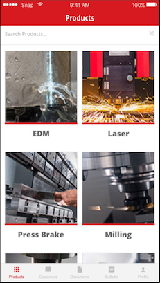
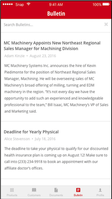
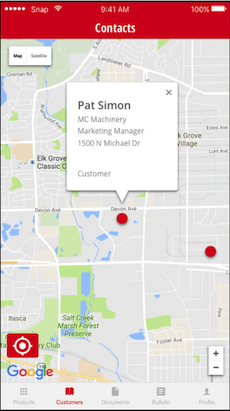

### Overview

I built the MC Machinery Systems mobile application while working at Snap Mobile. It's a product catalog and customer relationship management tool for sales people in the industrial machinery division of Mitsubishi. Users can view information on the products, email potential customers documents about the products, view customer locations in the app and see bulletins released by Mitsubishi. 

[App Store Link](https://itunes.apple.com/us/app/mc-machinery/id1135028838?mt=8
)

### Technical Details

* Front end built with Ionic, Angular 1.6 and Cordova
* Back end built with NodeJS, Express, MongoDB and hosted on Heroku
* Used Google Maps API for displaying customer locations on a map
 
### Images

